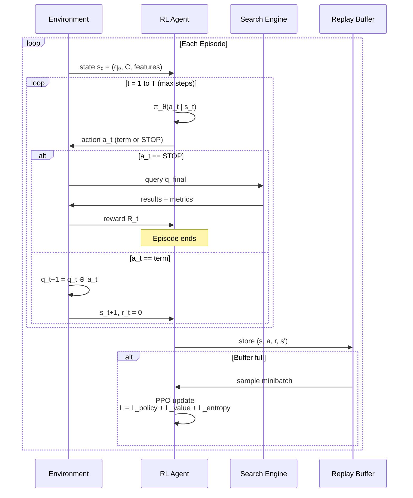
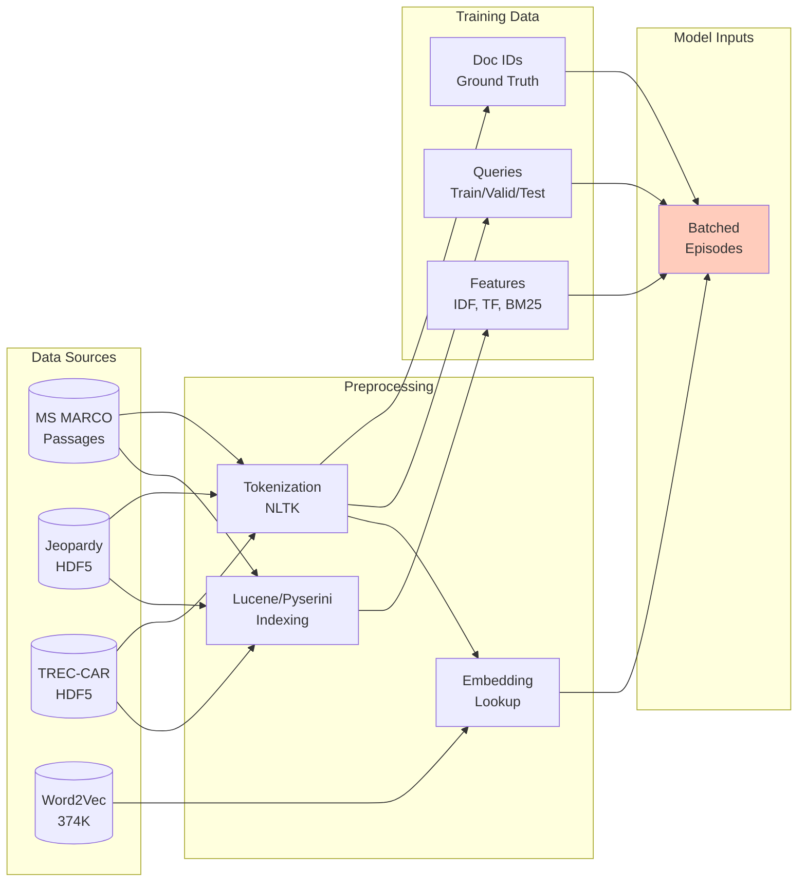
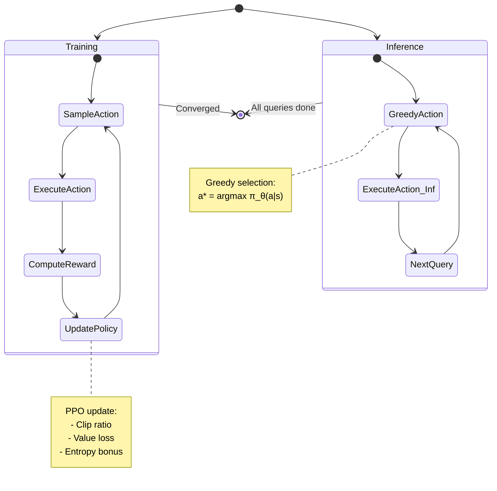
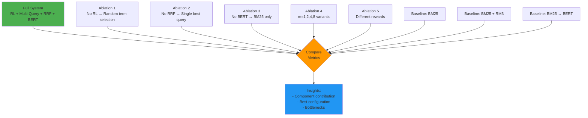
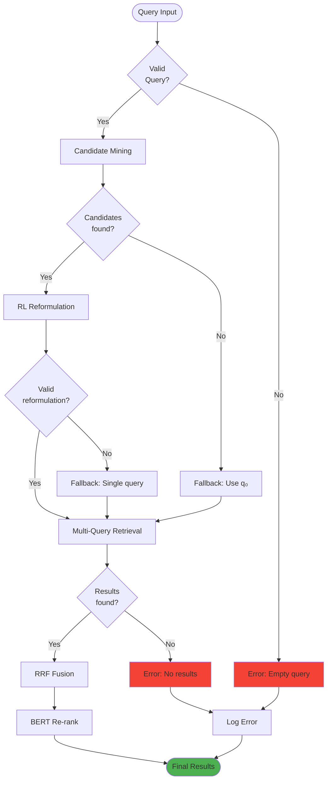
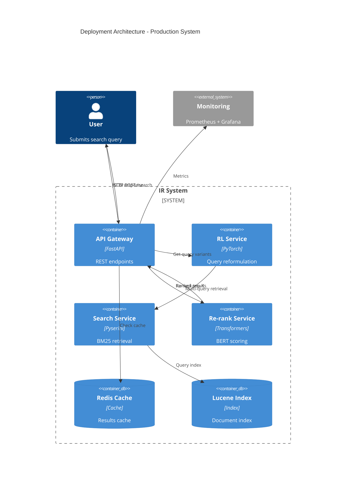

# MERMAID DIAGRAMS - System Architecture Visualization

## 1. TỔNG QUAN HỆ THỐNG (High-Level Architecture)

```mermaid
graph TB
    subgraph "Input"
        Q[Query q₀]
        GT[Ground Truth<br/>Qrels]
    end
    
    subgraph "Stage 0: Candidate Mining"
        BM25[BM25 Retrieval<br/>top-k₀ docs]
        TFIDF[TF-IDF<br/>Extractor]
        BMCS[BM25 Contribution<br/>Scorer]
        KB[KeyBERT<br/>Optional]
        C[Candidate Set C<br/>|C| ≤ 200]
        
        Q --> BM25
        BM25 --> TFIDF
        BM25 --> BMCS
        BM25 --> KB
        TFIDF --> C
        BMCS --> C
        KB --> C
    end
    
    subgraph "Stage 1: RL Query Reformulation"
        STATE[State s_t<br/>q₀, q_t, C, features]
        POLICY[Policy Network<br/>Actor-Critic]
        ACTION[Action a_t<br/>select term or STOP]
        QUERIES[m Query Variants<br/>q⁽¹⁾...q⁽ᵐ⁾]
        
        Q --> STATE
        C --> STATE
        STATE --> POLICY
        POLICY --> ACTION
        ACTION -->|repeat m times| QUERIES
    end
    
    subgraph "Stage 2: Multi-Query Retrieval + RRF"
        RET1[BM25 Retrieval<br/>L₁]
        RET2[BM25 Retrieval<br/>L₂]
        RETM[BM25 Retrieval<br/>Lₘ]
        RRF[RRF Fusion<br/>Σ 1/(k+rank)]
        TOPK[Top-K Candidates]
        
        QUERIES --> RET1
        QUERIES --> RET2
        QUERIES --> RETM
        RET1 --> RRF
        RET2 --> RRF
        RETM --> RRF
        RRF --> TOPK
    end
    
    subgraph "Stage 3: BERT Re-ranking"
        BERT[BERT Cross-Encoder<br/>MiniLM-L12]
        RERANK[Re-ranked Results]
        
        TOPK --> BERT
        Q --> BERT
        BERT --> RERANK
    end
    
    subgraph "Evaluation"
        METRICS[Metrics<br/>MRR@10, Recall@100<br/>nDCG@10, Latency]
        
        RERANK --> METRICS
        GT --> METRICS
    end
    
    style Q fill:#e1f5ff
    style RERANK fill:#c8e6c9
    style METRICS fill:#fff9c4
```

## 2. RL TRAINING LOOP



## 3. DATA FLOW PIPELINE



## 4. RL AGENT ARCHITECTURE

```mermaid
graph TB
    subgraph "Input Layer"
        Q0[Query q₀<br/>Embedding<br/>512-dim]
        QT[Query q_t<br/>Embedding<br/>512-dim]
        CAND[Candidates C<br/>N × 128 features]
    end
    
    subgraph "Encoder"
        CONCAT[Concatenate<br/>[q₀ ∥ q_t ∥ C]]
        TRANS[Transformer Encoder<br/>d=256, heads=4<br/>layers=2]
        ATT[Attention<br/>Q=q_t, K=C, V=C]
    end
    
    subgraph "Actor Head"
        ACT_FC1[Linear 256→128]
        ACT_RELU[ReLU]
        ACT_FC2[Linear 128→|C|+1]
        ACT_SOFT[Softmax]
        ACTION[Action Probs<br/>π_θ(a|s)]
    end
    
    subgraph "Critic Head"
        CRIT_FC1[Linear 256→128]
        CRIT_RELU[ReLU]
        CRIT_FC2[Linear 128→1]
        VALUE[Value V_ϕ(s)]
    end
    
    Q0 --> CONCAT
    QT --> CONCAT
    CAND --> CONCAT
    CONCAT --> TRANS
    TRANS --> ATT
    
    ATT --> ACT_FC1
    ACT_FC1 --> ACT_RELU
    ACT_RELU --> ACT_FC2
    ACT_FC2 --> ACT_SOFT
    ACT_SOFT --> ACTION
    
    ATT --> CRIT_FC1
    CRIT_FC1 --> CRIT_RELU
    CRIT_RELU --> CRIT_FC2
    CRIT_FC2 --> VALUE
    
    style ACTION fill:#81c784
    style VALUE fill:#64b5f6
```

## 5. RRF FUSION ALGORITHM

```mermaid
flowchart TD
    START([Start]) --> INPUT[Input: m ranked lists<br/>L₁, L₂, ..., Lₘ]
    INPUT --> INIT[Initialize:<br/>doc_scores = {}]
    INIT --> LOOP1{For each<br/>list i}
    
    LOOP1 -->|i ≤ m| LOOP2{For each<br/>doc d in Lᵢ}
    LOOP2 -->|has next| GET[Get rank_i(d)]
    GET --> CALC[score += 1/(k + rank_i)]
    CALC --> UPDATE[doc_scores[d] += score]
    UPDATE --> LOOP2
    
    LOOP2 -->|done| LOOP1
    LOOP1 -->|done| SORT[Sort by score DESC]
    SORT --> OUTPUT[Return merged list]
    OUTPUT --> END([End])
    
    style START fill:#e1bee7
    style END fill:#c5e1a5
```

## 6. EVALUATION PIPELINE

```mermaid
graph LR
    subgraph "Test Data"
        Q_TEST[Test Queries]
        QRELS[Relevance<br/>Judgments]
    end
    
    subgraph "System Under Test"
        SYS[Retrieve-Fuse<br/>-Re-rank System]
    end
    
    subgraph "Metrics Computation"
        REC[Recall@100<br/>Calculator]
        MRR[MRR@10<br/>Calculator]
        NDCG[nDCG@10<br/>Calculator]
        LAT[Latency<br/>Profiler]
    end
    
    subgraph "Results"
        REP[Evaluation Report<br/>Tables + Plots]
    end
    
    Q_TEST --> SYS
    SYS --> REC
    SYS --> MRR
    SYS --> NDCG
    SYS --> LAT
    
    QRELS --> REC
    QRELS --> MRR
    QRELS --> NDCG
    
    REC --> REP
    MRR --> REP
    NDCG --> REP
    LAT --> REP
    
    style REP fill:#fff59d
```

## 7. TRAINING vs INFERENCE MODE



## 8. ABLATION STUDY STRUCTURE



## 9. ERROR HANDLING & RECOVERY



## 10. DEPLOYMENT ARCHITECTURE



---

## USAGE INSTRUCTIONS

### Viewing Mermaid Diagrams

1. **VS Code**: Install "Markdown Preview Mermaid Support" extension
2. **GitHub**: Diagrams render automatically in README.md
3. **Online**: Copy to https://mermaid.live/

### Customizing Diagrams

- Edit node colors: `style NodeID fill:#colorcode`
- Change flow direction: `TB` (top-bottom), `LR` (left-right)
- Add notes: `note right of Node: text`
